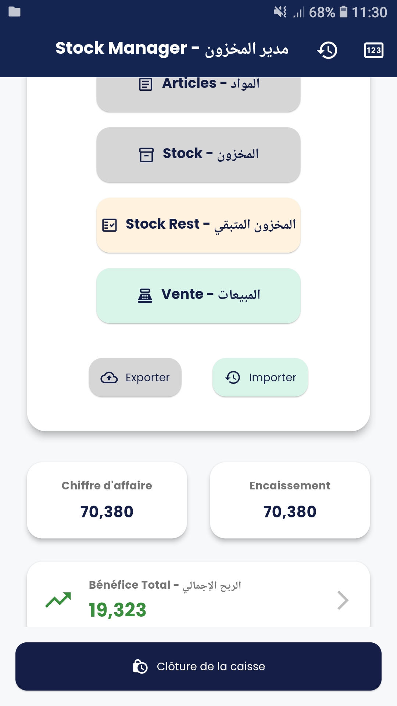
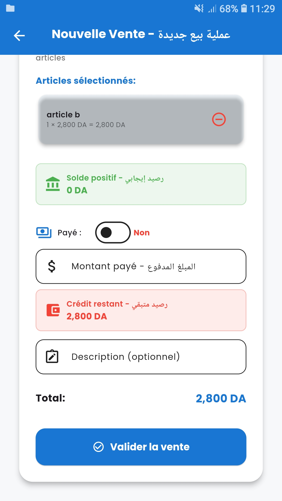
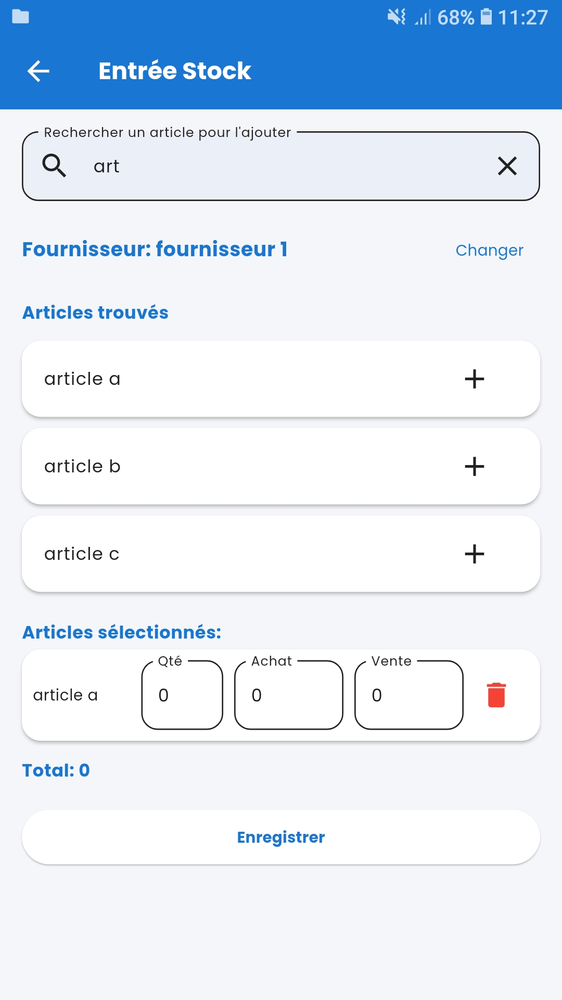
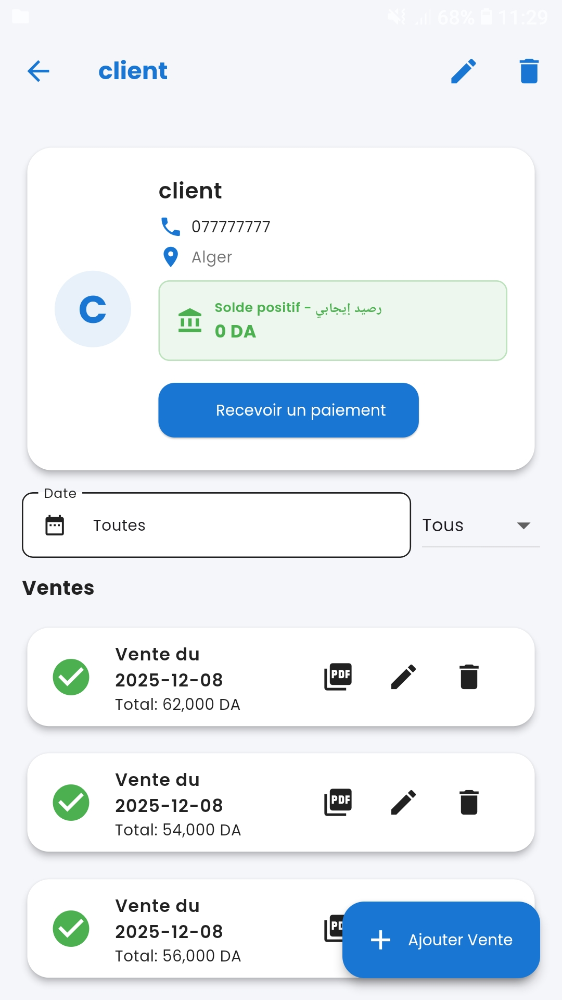
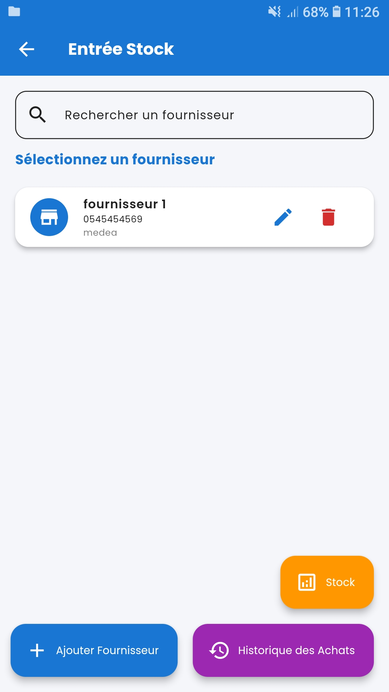
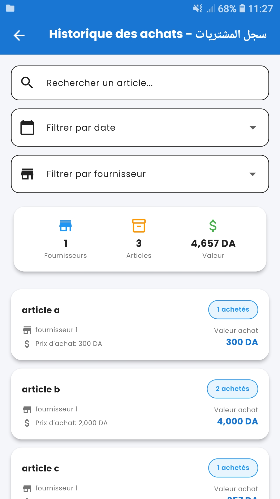
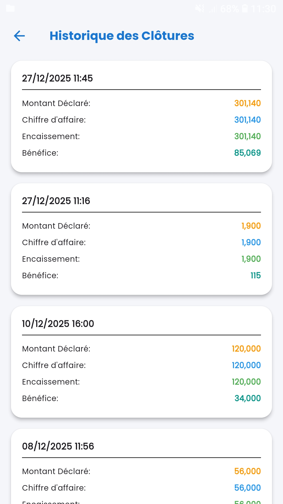
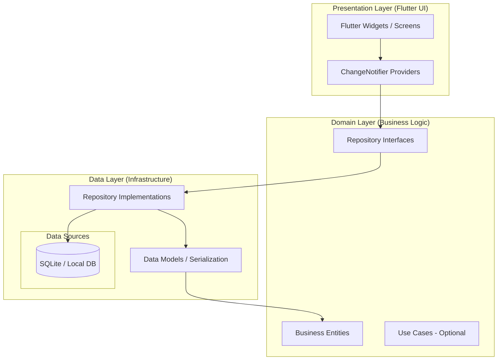

# Bachene Soft - Professional Stock & Sales Manager

[](https://flutter.dev)
[](https://blog.cleancoder.com/uncle-bob/2012/08/13/the-clean-architecture.html)
[](LICENSE)

A high-performance, professional stock and sales management application built with **Flutter**. Designed with **Clean Architecture** principles, this project demonstrates senior-level expertise in mobile development, state management, and robust local data persistence.

---

## 📸 visual Overview

| Home Screen | New Sale | Add Inventory |
| :---: | :---: | :---: |
|  |  |  |

| Client Management | Supplier Management | Inventory Check |
| :---: | :---: | :---: |
|  |  |  |

| Daily Closures |
| :---: |
|  |

---

## 🏗️ Architecture & Design

This project strictly adheres to **Clean Architecture** to ensure maintainability, testability, and scalability.



### Key Architectural Highlights:
- **Decoupling**: Business logic is completely separated from the UI and Data layers.
- **Dependency Injection**: Constructor-based DI is used throughout, following the **Dependency Inversion Principle**.
- **Type Safety**: Explicit type casting and generic handling ensure a stable, runtime-safe experience.
- **Mapping**: Clear separation between UI-facing `Entities` and database-focused `Models`.

---

## 🛠️ Technology Stack

- **Core**: [Flutter](https://flutter.dev) / Dart
- **Persistence**: `sqflite` (SQLite) for robust local storage.
- **State Management**: `provider` for efficient reactive updates.
- **Security**: 
    - `local_auth` for Biometric (Fingerprint/Face) authentication.
    - Custom Secure PIN lock system.
- **Reporting**: 
    - `pdf` & `flutter_pdfview` for professional receipt generation.
    - `share_plus` for easy data export.
- **Hardware Integration**: `blue_thermal_printer` for Bluetooth printing support.
- **Design**: `google_fonts` (Poppins) for a premium, modern aesthetic.

---

## 🚀 Getting Started

### Prerequisites
- Flutter SDK (>= 3.7.2)
- Android Studio / VS Code

### Installation
1. Clone the repository:
   ```bash
   git clone https://github.com/your-username/stock_manager.git
   ```
2. Install dependencies:
   ```bash
   flutter pub get
   ```
3. Run the application:
   ```bash
   flutter run
   ```

---

## 📝 Documentations

The project is thoroughly documented using **Triple-Slash DocComments** (`///`), making it easy for other developers to understand the business roles and API contracts of all core components.

---

© 2026 Bachene Soft. All rights reserved.
